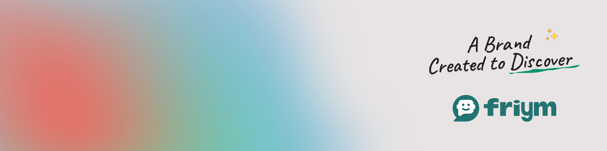

# Abdul A. KONDO

**`Digital Craftsman (Developer/Creator)`**

### Hi there 👋

I am an independent full-stack developer and content creator who has taken my version of the digital world one step at a time. All coding projects are integrated from scratch, from planning and design to solving real problems with code. I really enjoy learning languages ​​and frameworks like React and React Native, as well as making mockups in Adobe XD or Figma. I also enjoy wireframing, ui, ux, and design in general.

  

       
       
      
      
   

---

### 🧰 Languages and Tools

  
  
  
  
  
  
  
 

#

### 📊 Stats

<!--  -->

#
<!--
**Reqima-dev/Reqima-dev** is a ✨ _special_ ✨ repository because its `README.md` (this file) appears on your GitHub profile.

Here are some ideas to get you started:

- 🔭 I’m currently working on ...
- 🌱 I’m currently learning ...
- 👯 I’m looking to collaborate on ...
- 🤔 I’m looking for help with ...
- 💬 Ask me about ...
- 📫 How to reach me: ...
- 😄 Pronouns: ...
- ⚡ Fun fact: ...
-->
